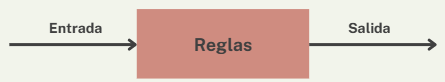
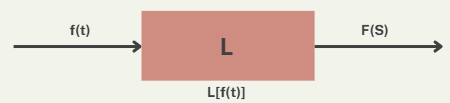
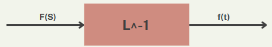

# Transformada inversa de laplace: Fracciones parciales + Matlab

## 1. Introducción
En la sesión del 19 de febrero, se profuncizó en la descomposición en fracciones parciales, abordando los últimos dos casos de fracciones parciales: Raíces reales repetidas y raíces complejas conjugadas. Para cada caso, se desarrolló un ejemplo práctico con su respectiva solución paso a paso. Además, se incorporó el uso de MATLABcomo herramienta para facilitar el análisis de sistemas mediante la Transformada de Laplace y su inversa. También se aprendió a emplear la función residue, que permite descomponer automáticamente expresiones en fracciones parciales, optimizando el tiempo y reduciendo posibles errores en los cálculos manuales.

## 2. Fracciones parciales
En la clase del 12 de febrero, se evidenció el caso 1: *Raíces reales y diferentes*, a continuación se presentan los dos casos restantes:

### 2.1. Sistema
>🔑 *Sistema:* Un sistema es una combinación de componentes que interactúan entre sí con el propósito de alcanzar un objetivo específico. Esta interacción puede representarse mediante reglas o relaciones matemáticas que establecen cómo las entradas del sistema afectan sus salidas.

Figura 1. Sistema

A partir de modelos matemáticos, se representa lo que ocurre en la variable de salida si se modifica la entrada del sistema. En la Figura 1 se representa de manera básica un sistema.
### 2.2. Sistema dinámico
>🔑 *Sistema dinámico:* Se le llama sistema dinámico al sistema donde la salida en el presente depende de una entrada del pasado.

A diferencia de un sistema estático, donde la salida solo depende de la entrada en curso. La dinámica de un sistema se basa en variables que varían respecto al tiempo. En pocas palabras, es un sistema que cambia a través del tiempo. 
### 2.3. Planta
>🔑 *Planta:* Es la parte física del sistema que se quiere controlar.

Usualmente es confundida con el sistema, sin embargo solo se considera la parte física del mismo; la planta puede ser reprensentada matemáticamente, a través de uno o varios sistemas.
### 2.4. Proceso
>🔑 *Proceso:* Secuencia de pasos o instrucciones para lograr un objetivo.
>
El proceso es como la "receta" de lo que se hará; aunque en control se usa frecuentemente para referirse a la _planta_, no son lo mismo. El proceso está más ligado al concepto de algoritmo que de planta.
### 2.5. Modelo dinámico
>🔑 *Modelo dinámico:* Un modelo dinámico es una expresión matemática que predecirá el comportamiento de un sistema dinámico y/o variable a lo largo del tiempo.

Básicamente un modelo dinámico busca obtener una expresión matemática, en el caso de control, que relacione una variable de interés respecto al tiempo. Como se sabe, la derivada calcula una **variación**; en este caso de una variable respecto al tiempo:

$$\frac {df(t)}{dt}$$

Tdo esto a partir del concepto de derivada, que se basa en la pendiente y el cambio de la misma de determinada función.
## 3. ED en sistemas dinámicos
Las ecuaciones diferenciales son fundamentales para modelar sistemas porque describen cómo cambian las variables en función del tiempo u otra magnitud, permitiendo representar matemáticamente fenómenos dinámicos como el movimiento, la transferencia de calor, el crecimiento poblacional o el comportamiento de circuitos eléctricos.
### 3.1. ¿Cómo luce un modelo de ED?
Al modelar sistemas, como se dijo anteriormente hay una entrada y una salida. Al modelarlo en una ED lo que varía son las constantes y las derivadas de orden n que se encuentren presentes en la ED, tanto la entrada como la salida del sistema no son números, son funciones:

$$ u(t) = a_1 \frac{d^2F}{dt^2} + a_2 \frac{dF}{dt} + a_3 F$$

Donde: a = Constantes del sistema; u = Entrada del sistema; F= Salida del sistema
### 3.2. Características de una ED
Hay diferentes tipos de ED basadas en la linealidad y variabilidad en el tiempo. La linealidad de una ecuación diferencial se refiere a que es lineal en la función incógnita y sus derivadas y la variabilidad en el tiempo se basa al cómo varía el modelo cuando transcurre el tiempo.
## 4. Clasificación de sistemas
### 4.1. Sistema lineal
>🔑 *Sistema lineal:* Se considera sistema lineal cuando satisface el principio de superposición (la respuesta a múltiples excitaciones simultáneas es igual a la suma de las respuestas individuales a cada excitación aplicada por separado) y satisface el principio de proporcionalidad (la relación entre la entrada y la salida es constante.

### 4.2. Sistema no lineal
>🔑 *Sistema no lineal:* Se considera sistema no lineal cuando no satisface el principio de superposición y tampoco satisface el principio de proporcionalidad. Su análisis es más complejo; es posible linealizarlos entorno a un punto de operación, lo que permite aplicar métodos de análisis en cierta región del sistema.
## 5. Modelamiento y validación
Al desarrollar un modelo matemático de un sistema a partir de leyes físicas, es importante considerar que siempre existirá un cierto grado de incertidumbre en los resultados obtenidos, debido a simplificaciones, suposiciones y posibles errores en los datos.

Para garantizar que el modelo obtenido represente con precisión el comportamiento del sistema real, es fundamental realizar un proceso de validación. Esto implica **comparar** la salida del modelo con la del sistema físico y evaluar si la diferencia es aceptable. En caso contrario, el modelo debe ajustarse iterativamente hasta que el error se reduzca a un nivel adecuado.

Además, la validación no solo permite mejorar la precisión del modelo, sino que también ayuda a identificar posibles limitaciones o factores no considerados.
## 6. Influencia de parámetros
Según los parámetros, hay diferentes comportamientos de un sistema:
### 6.1. Comportamiento sinusoidal
Un modelo se comporta sinusoidalmente cuando hay inexistencia de parámetros.

💡Ejemplo: Un péndulo ideal oscilando sin ningún tipo de fricción o resistencia al aire; se representaría mediante una amplitud y oscilación constante.
### 6.2. Comportamiento de decaimiento exponencial
Un modelo se comporta decayendo exponencialmente cuando existe el parámetro de disipación de energía. 

💡Ejemplo: Circuito eléctrico RC, donde la carga del capacitor disminuye con el tiempo de forma exponencial debido a la disipación de energía en la resistencia.
### 6.3. Combinados
Un modelo se comporta de forma combinada cuando el sistema tiene oscilaciones "amortiguadas", cuando el sistema tiene una resistencia o fricción que no es lo suficientemente grande como para detener las oscilaciones de inmediato, pero sí las reduce con el tiempo. 

💡Ejemplo: un péndulo oscilando en aceite. Su movimiento es inicialmente oscilatorio (sinusoidal), pero la fricción con el fluido provoca que la amplitud de las oscilaciones disminuya exponencialmente hasta detenerse.
## 7. Transformada de Laplace
>*Transformada de Laplace:* Es una transformada que convierte una función de una variable real en el dominio del tiempo a una función de variable compleja en el dominio de la frecuencia (s). 

Básicamente es una herramienta matemática utilizada para resolver ecuaciones diferenciales con condiciones iniciales. Es ampliamente aplicada en el análisis de sistemas dinámicos y circuitos eléctricos, ya que permite transformar ecuaciones diferenciales en ecuaciones algebraicas más sencillas de manejar. La transformada muestra componentes sinusoidales y exponenciales de la señal. Mediante la definición, es una integral impropia que va desde 0 hasta infinito como se evidencia en la siguiente ecuación:

$$ f(t) \to F(S) $$
$$ \mathcal{L}\{f(t)\} = F(s) = \int_0^{\infty} f(t) e^{-st} \, dt $$

En la figura 2, se observa una representación un poco más gráfica:

Figura 2. TL

Entre las propiedades de la TL, se puede ver la linealidad, una propiedad que se usa todo el tiempo.
A continuación, se evidencian algunas transformadas importantes a tener en cuenta:
### 7.1. Transformada inversa de Laplace
La transformada inversa de Laplace es cambiar una función del dominio de la frecuencia compleja al dominio del tiempo; se definde de la siguiente manera:

$$ F(S) \to f(t) $$
$$ \mathcal{L}^{-1}\{F(s)\} = f(t) = \frac{1}{2\pi i} \int_{\sigma - i\infty}^{\sigma + i\infty} F(s) e^{st} \, ds $$

Figura 3. TL inversa
### 7.2. Transformadas esenciales 
#### 7.2.1 Transformada de una función
$$ \mathcal{L}\ {f(t)\} = F(S)$$
#### 7.2.2 Transformada de la derivada
$$\mathcal{L} \{ f^{n}(t) \} = s^n F(s) - s^{n-1} f(0) - \cdots - s f^{n-1}(0) - f^n(0)$$
#### 7.2.3 Transformada de la integral
\mathcal{L} \left\{ \int f(t) \, dt \right\} = \frac{1}{s} F(s)

# 8. TL Inversa: Fracciones parciales
Para solucionar una ED, se hace uso de la TL, sin embargo en función la la frecuencia compleja no tiene alguna empleabilidad, por ende se debe volver al dominio del tiempo para hallar la solución de la ED. Mediante la definición se pueden determinar las transformadas y sus inversas; sin embargo, existe una "Tabla de transformadas", la cual será fundamental para llegar nuevamente al dominio del tiempo. Por ahora se verá un repaso de fracciones parciales; pues es fundamental llegar a la expresión más "reducida"  y leer la tabla de transformadas mucho más sencillo. En esta sesión se recordó el primer caso: raíces reales y diferentes.
## Caso 1: Raíces reales y diferentes
En el denominador de F(S), hay diferentes factores lineales que no se repiten. La intención es separar cada fracción con un numerador A, B, C,..., n:

$$F(S) = \frac{P(s)}{Q(s)} = \frac{P(S)}{(s + p_1)(s + p_2) \dotsm (s + p_n)}$$

$$F(S) = \frac{A}{(s + p_1)} + \frac{B}{(s + p_2)} + \dots + \frac{N}{(s + p_n)}$$

💡Ejemplo:

## 9. Ejercicios
### 📚 Ejercicio 1
### 📚 Ejercicio 2
## 10. Conclusiones
En esta sesión, se exploraron conceptos fundamentales para el estudio y análisis de sistemas dinámicos. Se comprendió qué es un sistema y cómo se diferencia un sistema dinámico de uno estático, destacando la importancia del su variabilidad en el timpo. También se analizó la distinción entre una planta y un proceso, que a pesar que en control sean considerados sinónimos, no lo son.

Adicionalmente, se identificó el papel fundamental de las ecuaciones diferenciales en el modelado de sistemas, que permiten describir su comportamiento matemáticamente. Finalmente, se hizo la introducción a la Transformada de Laplace como una herramienta para resolver ecuaciones diferenciales

Estos conceptos constituyen la base para comprender y desarrollar estrategias de control y análisis.

## 11. Referencias
Agregue un subtítulo al final donde pueda p
